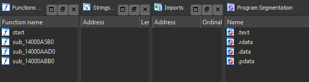

# Druid

This project was done purely for educational purposes. In the essence of time, little effort was allocated toward safely parsing input files. Do **not** input programs you did not compile yourself.

## Features

- Encrypts input program

- Supports a customizable stub

- Stub has no strings, imports, or extra sections

  

## Limitations

- Stub doesn't support symbols or resources
- Does not support delayed or forwarded imports
- Does not support exports
- Does not enforce page protections
